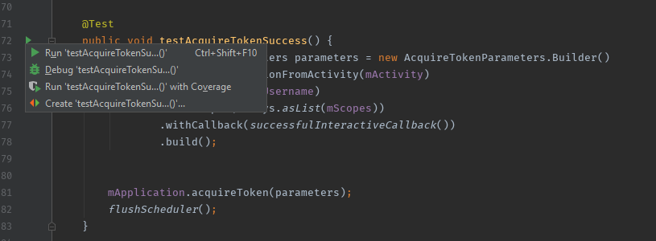
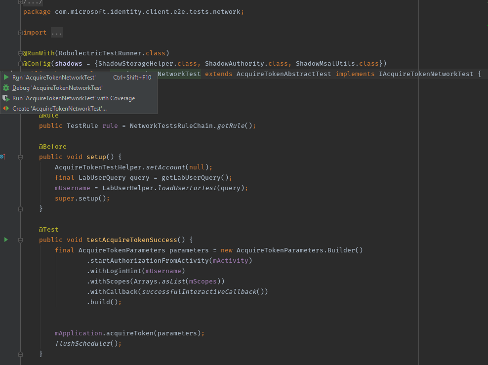
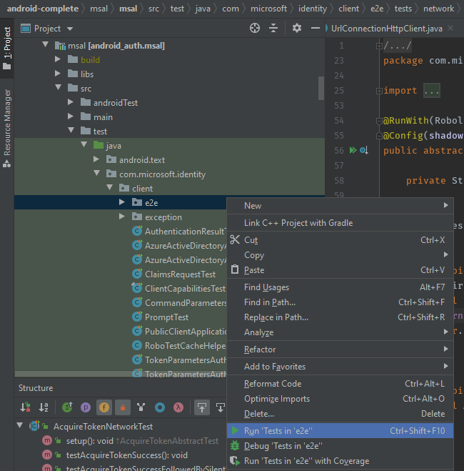

# How to run Android Auth Client SDK Tests

In this doc, we will go over how to run tests on Android as well as how to *specifically* run Auth Client SDK tests properly (as there might be some nuances).

## Related Readings

- [Testing Overview](./testing_overview.md)

- [Lab Setup](./labsetup.md)

- [Gradle Project Properties as Command Line Arguments](../ProjectBuild/gradle_project_properties.md)

## General Ways to run Android Tests

In general Android Tests can be run in a couple of ways:

### Run from Command Line

We can run Android Tests from command line by executing the gradle command:

`./gradlew <module>:<testCommand>`

For example, one could run the unit tests in a project called as `msal` as follows:

`./gradlew msal:testLocalDebugUnitTest`

We can also pass flag and parameters to filter based on class, package etc. We can learn more here: [Test from the command line - Android Developers](https://developer.android.com/studio/test/command-line)

### Run from Android Studio

We can also run test(s) from Android Studio by clicking the run button as follows

#### Running a single test

#### Running all Tests in a Class

#### Running all Tests in a Package

## How to run Android Auth Client Robolectric Tests

Prior to reading this, please read the [Testing Overview](./testing_overview.md) doc as we will refer to some concepts here that are meantioned in that doc.

When it comes to running our tests, the primary differences lie in whether the test makes a network request or not, because tests that make network requests are usually tests that go to AAD using real accounts for testing token acquisition. Any tests that are using real accounts for testing E2E flows are using Accounts supplied by the Lab API. Lab API is a protected API and we authenticate against that using a confidential client. This means that we would need to supply the `labSecret` as a command line argument when running any tests that use the Lab API. For more info, please read this: [Lab Api](./labsetup.md)

## How to run Android Auth Client UI Automation

UI Automation can be run in the same way as any other Android Test (either from command line or from Android Studio), however, whether the tests succeeds or fails upon running is subject to some additional criteria such as the presence of specific apps on the device or the supplying of specific flags when running the tests. We will go over these below.

### Where are UI Automation Tests Located?

Before we go into the specifics of running tests, let's review where these tests are located. UI Automation Tests are located in two different projects:

- MSAL Automation App
  
  - Contains all MSAL Tests (with and without Broker)

- Broker Automation App
  
  - Contains Broker with ADAL Test Cases
  
  - Contains Broker with First Party App Test Cases
  
  - Also happens to contain some ADAL without Broker test cases (These were added here in interest of time to avoid creating a separate ADAL Automation app - we will relocate this in the future if needed)

### Supported devices/emulators

The UI Automation tests are currently optimized for Pixel 2, 3 and 4 and API levels 28 and 29 (emulator images should include Google Playstore). The tests may run fine on other devices too, however, we don't provide any guarantee because we haven't validated them. Over time we will try to optimize for more devices.

### Preparing a device/emulator

For the tests to run successfully the device/emulator must have the Google PlayStore installed.  The tests will install apps from the PlayStore during their execution.  The device/emulator PlayStore app will also need to be signed in with a google account before running the tests.  

### What Project Properties are supported when running UI Automation?

UI Automation Tests support passing some additional command line arguments that can control the behavior of the tests. Some of these arguments may or may not be needed depending on your needs if you find yourself sticking to the defaults. 

For example, the following properties are supported / required:

- **labSecret** (required) - to enable authentication against Lab Api. Fore more details see [Lab Setup](labsetup.md)

- **brokerSource** (optional / default: `PlayStore`) - Determines where to install the broker app such as Authenticator & CP from when running the automation. When we are testing MSAL then we would want this to be `PlayStore` and when we are testing the broker release then we would want this to be `LocalApk` so that we can run the automation against the RC bits of Broker Apps that we obtain for testing. In the case of LocalApk, the broker app must be sideloaded on the device prior to the start of the test and this APK must dropped in the `/data/local/tmp` folder on the device because the Automation Infra will look for it in that folder and try to install it from there.

There are more aguments supported. For a complete list of supported command line arguments across each of our projects, please see [Gradle Project Properties as Command Line Arguments](../ProjectBuild/gradle_project_properties.md).

### Suggested Android Studio Project Settings

#### MSAL/ADAL Testing

When running the tests from within Android Studio we suggest configuring compiler settings to pass in project properties as command line options.  You can enter suggested defaults in Android Studio by:

- Select "File" menu
- Select "Settings"
- Select/Expand "Build, Execution, Deployment"
- Select "Compiler"
- Enter: "-Plabtest -PlabSecret="[Put Lab Secret Here]" -PbrokerSource="PlayStore"

> NOTE: This assumes you're testing MSAL changes with existing production Microsoft authenticator.

##### Test Configuration

| Scenario | Project | Variant | brokerSource |
|----------|---------|--------------|-------|
| MSAL Changes | msalautomationapp:        |     localBrokerMicrosoftAuthenticationDebug          |  PlayStore     |
|   MSAL Changes & Broker Changes       |   msalautomationapp      |      localBrokerHostDebug        |   Ignored (uses local)    |
|     MSAL Changes & Authenticator RC Build     |    msalautomationapp     |      localBrokerMicrosoftAuthenticationDebug        |   LocalApk    |

### Additional Apps Required When Running UI Automation

Some of our UI Automation Tests require installing additional apps on the device when running the tests. These apps are as followed:

- **BrokerHost**
  
  - Required when running tests against BrokerHost as the broker app
  
  - APK must be dropped in the `/data/local/tmp` directory and be named as `BrokerHost.apk`

- **AzureSample**
  
  - Required by some of the MSAL Tests to test multi-app scenario and therefore this app must always be supplied
  
  - APK must be dropped in the `/data/local/tmp` directory and be named as `AzureSample.apk`

- **Authenticator**
  
  - Required when running tests against Authenticator as the broker app
  
  - Will be installed from `PlayStore` if `brokerSource` is `PlayStore` otherwise for `LocalApk` testing the APK must be dropped in the `/data/local/tmp` directory and be named as `Authenticator.apk`

- **CompanyPortal**
  
  - Required when running tests against Company Portal as the broker app
  
  - Will be installed from `PlayStore` if `brokerSource` is `PlayStore` otherwise for `LocalApk` testing the APK must be dropped in the `/data/local/tmp` directory and be named as `CompanyPortal.apk`

#### How to Push APKs to the device

We can push APKs to the device as follows:

`adb push <path-to-apk-on-pc> <path-to-apk-on-device>`

For instance to push an APK for BrokerHost app to the `/data/local/tmp` directory we can do so as follows:

`adb push "c:\Files\BrokerHost.apk" "/data/local/tmp/BrokerHost.apk" `

We can also achieve this from within Android Studio using [Device File Explore](https://developer.android.com/studio/debug/device-file-explorer).

### Automation Apps Supported Flavors

The UI Automation can be run against a variety of flavors across the auth library being useds as well as the broker being used.

See `./gradlew msalautomationapp:tasks` or `./gradlew brokerautomationapp:tasks` for a complete list of tasks.

##### MSAL / ADAL

- local - Use local source code present on your machine and branch currently checked out

- dist - Use MSAL / ADAL from Maven Central based on version specified in `build.gradle`

##### Broker

- BrokerMicrosoftAuthenticator - runs tests against Microsoft Authenticator as the broker app

- BrokerCompanyPortal - runs tests against CompanyPortal as the broker app

- BrokerHost - runs tests against BrokerHost as the broker app

- AutoBroker - runs tests against any supported broker for a given test as applicable with the select flavor of MSAL / ADAL

### How to get Automation logs after tests completion

We write two sets of logs in our automation. These are as follows:

- **MSAL logs** 
  
  - Logs produced by MSAL library
  
  - These are saved in a file named as `<test-name>-msal.log`

- **Automation** **logs**
  
  - Logs produced by our Automation infrastructure
  
  - These are saved in a file named as `<test-name>-automation.log`

All of these logs are saved in the `/sdcard/automation` directory on the device.

We can pull these using either `adb pull` command or we can also view these directly in Android Studio using [Device File Explore](https://developer.android.com/studio/debug/device-file-explorer).

### Pipelines / Scripts to facilitate automation during releases

We have created pipelines and/or scripts to facilitate running automation during releases, you can find them here: [Release Automation Pipelines & Scripts](release_automation_scripts.md)
