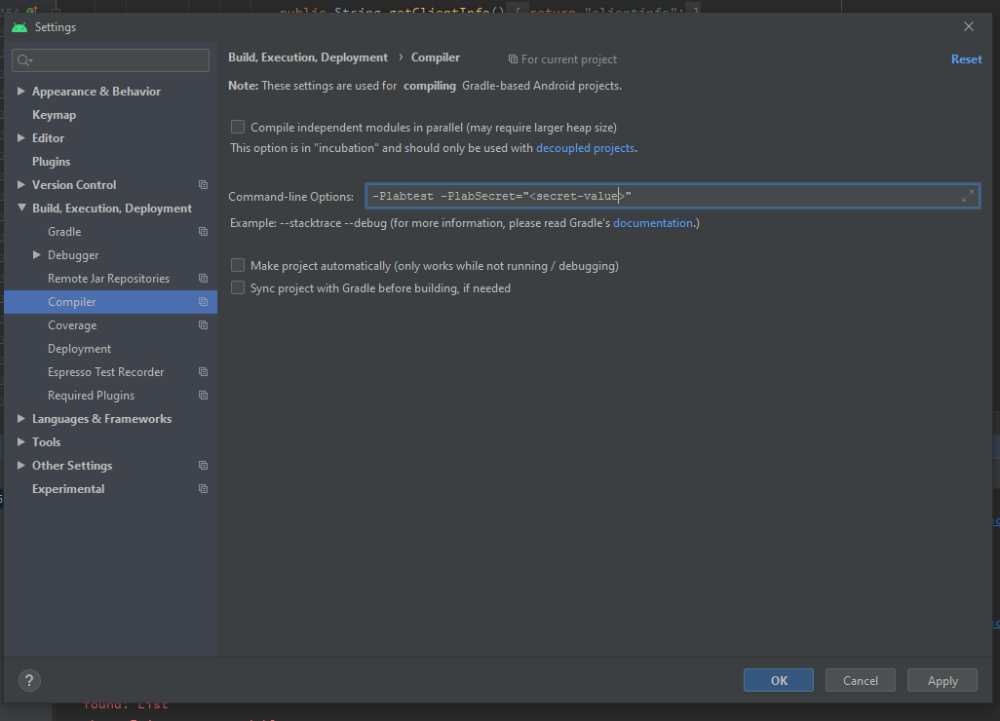

# Lab Setup for running Automation

## Introduction

Lab API is an API that allows fetching test user accounts and their passwords that can be used in the context of either manual testing or automated testing. To learn more about the LAB API, please visit: https://aka.ms/idlabs

Android MSAL / Broker End-to-End tests that hit the network use the Lab API provided by the lab team to obtain test accounts. We have generated a swagger client for the lab api by using the json file that they provided. Link to lab api swagger: https://msidlab.com/swagger/index.html

The code for this swagger client is located here: https://github.com/AzureAD/microsoft-authentication-library-common-for-android/tree/dev/labapi

## Authentication

The Lab Api is a protected Api and we need an access token to be able to make request against the Lab Api. Since we use the Lab Api as part of our automated tests, we need to programmatically access the Lab Api as an application (without any context of a user) and thus we need to make a client credentials grant request to the ESTS to obtain an access token for our application that has been given permission to the use the Lab Api. You can find the details about programmatic access here: https://docs.msidlab.com/labapi/intro.html?q=client

There are two ways to make a client credential grant request: 

- using a client secret
- using client_assertion

We support either of these mechanism to authenticate against KeyVault and Lab Api, however, the cert is not suitable for running on Android device is the Security Provider that was used to create it is not available on the device, and therefore the client secret will work in all cases.

**NOTE:** Please note that you must be a Microsoft employee and part of the relevant groups to be able to acquire credentials that are necessary for authenticating against the LAB API. In other words, the LAB API and the tests that utilize it are only going to run successfully if you have the right permissions.

### With Secret - (Recommended for Instrumented Tests)

**How to get access to the KeyVault where Client Secret is stored (You MAY skip this if already have access):**

1. Go to myaccess/
2. Click on request access
3. Request permissions from one of the following groups:
    - If a member of the Identity org, request read-write permissions from **tm-msidlabs-int**
    - If outside the Identity org, request read access to **TM-MSIDLABS-DevKV**
5. You can also reach out to *msidlabint@microsoft.com* to ask them for a rushed approval
6. After access has been approved, wait for 2-24 hours for changes to be effective.

**How to get the secret for accessing Lab Api:**

1. Go to Azure Portal: https://portal.azure.com/ and login with MS credentials
2. Switch to the Microsoft directory (if not already there)
3. Search for the KeyVault named "**AdalTestInfo**" (be sure to select "all" for the subcription, location etc filters) 
4. Click into the **AdalTestInfo** keyvault
5. Under settings, click on secrets
6. The secret we are looking for is called **AndroidAutomationRunnerAppSecret**
7. Get the value for this secret and copy to clipboard

**How to run the tests with this secret:**

To run tests with client secret, you would have to pass the following command line parameters when building/running tests.
`-PlabSecret="<secret-value>"`

**Example test execution**

`./gradlew app:test -PlabSecret="<secret-value>"`

**From within Android Studio**

This can also be achieved from within Android Studio as follows:

### With Client Assertion (Certificate) - (Recommended for JVM Tests)

Client assertion uses a certificate, therefore we need to have a certificate installed on our local machine for us to be able to successfully create a client_assertion and be able to obtain the access token for the Lab Api. This certificate is stored securely in a KeyVault that all Microsoft employees can get access to, and from there they can download it onto their local machines. Read through the steps below to obtain the certificate required for the lab automation.

**How to get access to the KeyVault where Certificate is stored (You MAY skip this if already have access):**

1. Go to myaccess/
2. Click on request access
3. Request permissions from one of the following groups:
    - If a member of the Identity org, request read-write permissions from **tm-msidlabs-int**
    - If outside the Identity org, request read access to **TM-MSIDLABS-DevKV**
5. You can also reach out to *msidlabint@microsoft.com* to ask them for a rushed approval
6. After access has been approved, wait for 2-24 hours for changes to be effective.

**How to get the certificate for accessing Lab Api:**

1. Go to Azure Portal: https://portal.azure.com/ and login with MS credentials
2. Switch to the Microsoft directory (if not already there)
3. Search for the KeyVault named **AdalTestInfo** (be sure to select "all" for the subcription, location etc filters)
4. Click into the **AdalTestInfo** keyvault (if you don't see this KeyVault, make sure you follow the above steps to get access to the KeyVault)
5. Under settings, click on certificates
6. Click on the AndroidAutomationRunner to open the cert in detail view
7. Click on the current version to view details about the current version
8. Download it on your local machine in the PFX/PEM format
9. After download, double click on the cert file to install on your machine
10. When prompted for location of installation, select CurrentUser and for certificate store select Personal
11. If prompted for password, you can optionally enter one but it is not required. 
12. Proceed through the steps to finish the installation.

### Potential Issues and Mitigation Steps

We already have an application registered in the Microsoft directory and that application has been authorized to access the Lab Api. This application is called AutomationRunner. To view information about this application, go to Azure Portal and then go to app registrations and search for this application by its name.  

After following the lab setup steps declared earlier in this doc, you should be able to run all the tests that use the Lab Api. If you encounter any issues with the certificate, it is possible that the certificate has expired. Read through the below steps to get a new certificate.

**How to check certificate information about a registered application:**
1. Go to Azure Portal: https://portal.azure.com/ and login with MS credentials
2. Switch to the Microsoft directory (if not already there)
3. Go the App Registrations and search for your app (in this case search for AutomationRunner)
4. Click into the AutomationRunner app to view details
5. In the left pane, under manage, click on Certificates & secrets
6. You should see all certificates for this app. Based on the expiration date, you will know if a cert has expired.
7. If a cert has expired, you can delete that one and upload a new one (Read below on how to create a new certificate)

**How to create a new certificate for Lab Api via Azure Portal (preferred way):**
1. Go to Azure Portal: https://portal.azure.com/ and login with MS credentials
2. Switch to the Microsoft directory (if not already there)
3. Search for the KeyVault named "AdalTestInfo" (be sure to select "all" for the subcription, location etc filters) (see screenshot below)
4. Click into the AdalTestInfo keyvault (if you don't see this KeyVault, make sure you follow the above steps to get access to the KeyVault)
5. Under settings, click on certificates
6. Click on Generate/Import
7. Choose Generate as method of creation
8. Enter a certificate name (could be any name but pick a name relevant to its purpose)
9. For Subject, enter: "CN=AutomationRunner"
10. Leave the rest of the settings as is and click create.
11. Now download this certificate in the PFX/PEM format and upload it to the AutomationRunner application. 

**How to create a new certificate for Lab Api via Powershell:**

1. Open powershell and run the following command:
    `$cert=New-SelfSignedCertificate -Subject "CN=AutomationRunner" -CertStoreLocation "Cert:\CurrentUser\My"  -KeyExportPolicy Exportable -KeySpec Signature`
2. The certificate should be created in the user certificate store. 
3. Export the certificate
    a. Go to Control Panel
    b. Manage User Certificates
    c. Personal -> Certificates
    d. Right click on certificate created in step 1 (AutomationRunner in this case)
    e. Click on All Tasks -> Export
    f. Go through the wizard to export the cert and store locally in some folder
4. Now go back to Azure Portal and upload this cert to the AutomationRunner application

**How to upload a new certificate for a registered application (AutomationRunner app in our case):**
1. Go to Azure Portal: https://portal.azure.com/ and login with MS credentials
2. Switch to the Microsoft directory (if not already there)
3. Go the App Registrations and search for your app (in this case search for AutomationRunner)
4. Click into the AutomationRunner app to view details
5. In the left pane, under manage, click on Certificates & secrets
6. You should see all certificates for this app. Based on the expiration date, you will know if a cert has expired.
7. Click on Upload Certificate button and upload a new certificate