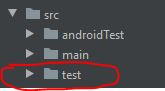
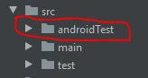
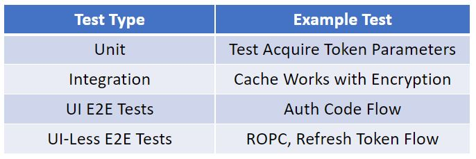

# Android Auth Libraries Automation Testing Overview

The Android Auth Libraries maintain a few different kinds of automation tests and we will go over them below.

## References

- [Fundamentals of Testing on Android](https://developer.android.com/training/testing/fundamentals)
- [Guide to Testing Apps on Android](https://developer.android.com/training/testing)
- [Types of Tests on Android](https://developer.android.com/training/testing/unit-testing)
- [Where to write Android Tests](https://developer.android.com/studio/test)
- [Testing from the command line](https://developer.android.com/studio/test/command-line)
- [JUnit](https://junit.org/junit4/)
- [Android JUnit4](https://developer.android.com/reference/androidx/test/ext/junit/runners/AndroidJUnit4)
- [Android Test Library](https://github.com/android/android-test)
- [Mockito](https://github.com/mockito/mockito)
- [Robolectric](http://robolectric.org/)
- [UI Automator](https://developer.android.com/training/testing/ui-automator)
- [Android Test Orchestrator](https://developer.android.com/training/testing/junit-runner#using-android-test-orchestrator)

## Types of Tests on Android

For Android apps and libraries, there are 2 basic types of automated tests as follows: 

### Local JVM Tests

Tests that run locally on your machine in the Java Virtual Machine (JVM). Since these tests run inside the JVM, they are fast to run however, tests that depend on the Android framework and/or OS level classes are not usually suitable for these types of tests as it usually requires the developer to mock such objects (though this can be avoided by using a framework called as Robolectric - we will cover this later below).
These tests are usually located under the `src/test` directory of a project:

### Instrumented Tests

Tests that run on a real Android device or an emulator. Since these tests run on Android device they have access to real Android framework objects such as the `Context` and `Package Manager` and the developer wouldn't need to mock these. Since these tests run on a device they are usually slow to run.
These tests are usually located under the `src/androidTest` directory of a project:

## Overview of Android Testing frameworks used by Android Auth Client

The Android Auth Client team uses the following frameworks across different kinds of tests. Right now, we will just go over what these are and in the next section we will review how we use these to write different kinds of tests.

### JUnit

Junit is the most popular framework for writing tests in JAVA and we are using JUnit4 for writing JVM Based tests in our libraries. We can learn more here: https://github.com/junit-team/junit4

[AndroidJUnit](https://developer.android.com/reference/androidx/test/ext/junit/runners/AndroidJUnit4) is a runner that helps writing JUnit4 instrumented tests on Android that can be run on devices.

### Mockito

Mockito is one of the most popular mocking frameworks that can be used while writing tests for JAVA projects.

In Android, we can use Mokcito to create mocks of Android OS framework objects such as `Context` and `Package Manager`. We can read more here: [Mockito](https://github.com/mockito/mockito)

### Robolectric

Robolectric is a framework that facilitates writing tests on Android that can be run in the JVM while still allowing the developer to exercise Android framework specific aspects of their code in the test. In other words, tests are fast as they run in the JVM and the developer doesn't need to mock objects as that is taken care of by Robolectric using a mechanism called as Shadowing. We can learn more about Robolectric here: http://robolectric.org/

### Android Test Library

This an AndroidX based test library from Android that is meant primarily for writing Instrumented tests that run on device. We can learn more here: [GitHub - android/android-test: An extensive framework for testing Android apps](https://github.com/android/android-test)

### UI Automator

UI Automator is testing framework on Android that allows developer to write UI Tests. The benefit of UI Automator over Espresso (which is another UI Automation framework) is that UI Automator has the ability to perform cross app user interaction i.e. with UI Automator we can write tests that can interact with the UI of not only the app being tested but also interact with the UI in the other apps installed on the device including system apps. We can learn more about UI Automator here: [UI Automator - Android Developers](https://developer.android.com/training/testing/ui-automator)

### Android Test Orchestrator

Android Test Orchestrator is a tool that allows us to run each instrumented tests in its own instrumentation so that each test has minimal shared state and the crashes are isolated i.e. a crash in one test doesn't bring down a crash in another test. We can learn more here: [Android Test Orchestrator](https://developer.android.com/training/testing/junit-runner#using-android-test-orchestrator)

## Android Auth Library Testing Philosophy

We maintain a few different kinds of automation tests in our Android Auth Libraries as follows:

### Unit Tests

Our Unit Tests are mostly written using `Robolectric` and the current plan is to use `Robolectric` for most of our Unit Tests going forward, however, we still have older written Unit Tests that are using `JUnit` or are written as instrumented tests.

Unit Tests are meant to be run on every check-in / Pull Request.

### Integration Tests

Some of our Integration Tests are writting using `Robolectric` while some others are written as Instrumented Tests using `AndroidJUnit`.

The current plan is to use `Robolectric` for integration tests as much as possible going forward.

Integration Tests are meant to be run on every check-in / Pull Request.

### UI-Less E2E Tests

For Android Authentication Client SDK, we define a UI-Less E2E Tests that allows us to exercise an E2E flow using our Public API without having to perform any UI interaction in the tests. These tests allow us to exercise the following flows E2E:

- Test Get Account / Remove Accounts API

- Test Token Fetch using Password Grant

- Test Token Fetch using Refresh Token Grant

- Test Token Fetch for a Confidential Client

All of our UI-Less E2E tests are written using `Robolectric` and are meant to be run on every check-in. 

The Android Client still tests the `acquireToken` (interactive) public APIs with these tests by changing the grant type from `authorization_code` to `password` during tests using [Robolectric Shadows](http://robolectric.org/extending/) so that we don't have UI pop-up and we are still able to tests other aspects of our library such as whether tokens are cached properly after an `acquireToken` request and that are leveraged properly by the following `acquireTokenSilent` request.

These tests use Test Accounts available from the [Lab Api](./labsetup.md).

### UI E2E Tests

For Android Authentication Client SDK, we define UI E2E Tests as tests that allow us to exercise all aspects and flows of our libraries in an E2E manner. These tests allow us to exercise the following flows (This is just a basic list - there should be many more flows): 

- Test Token Fetch using Authorization Code Grant

- Test Broker Auth Flows

- Test Device Registration Flows

- Test MDM Flows using Company Portal

- Test WebView integration

- Test integration with Browsers

All of our UI E2E Tests are written using `UI Automator` and also use `Android Test Orchestrator` to ensure high reliability.

Our UI E2E Tests are currently only run on a nightly pipeline.